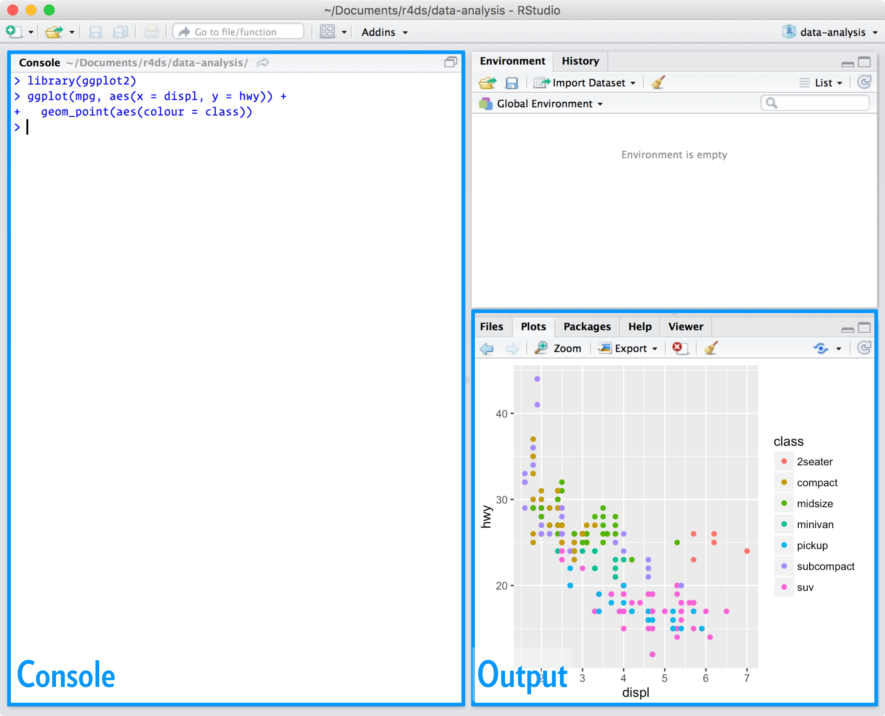
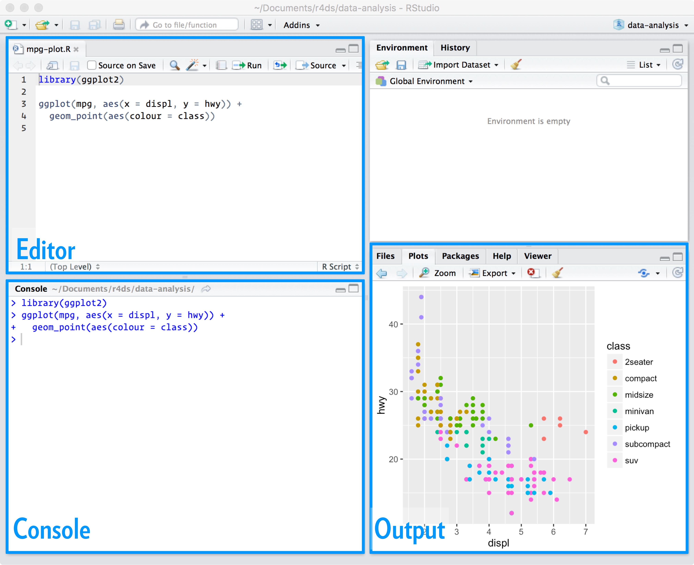

```{r setup, include=FALSE}
library(learnr)
library(png)
library(tidyverse)
knitr::opts_chunk$set(echo = TRUE, fig.align = "center")

```

## Introduction

### Learning Objectives

Attendees should be able to:

1.  Use basic R operator syntax and access R packages
2.  Understand the layout of the RStudio integrated development
    environment (IDE)
3.  Make simple data visualisations with ggplot2

### Course Philosophy

-   Scheduling around other responsibilities can be difficult. I want to
    maintaining compatibility with the current Python club format.
    Consequently, I will talk for less than 30 mins talking each session
    to run through the material, then allowing time for Q&A and most
    importantly **practising writing code**.
-   I will point to further resources as we go. Many of these are very good resources indeed. You can teach yourself R **for free** using online resources only. I encourage you to look at these 
    resources where you want more detail on a particular area.
-   I will assume no familiarity with R, but will try to take
    into account people"s background and interests. If you"re starting
    from scratch sessions should not overwhelm you.
-   Each session should allow attendees to come away having learnt how
    to at least one R skill, maintaining the motivation to learn. I
    don"t want to spend each session covering 20% of a particular skill,
    meaning you"ve got to come to 5 sessions to get something out. I
    will try to include at least one "motivating" topic each session,
    smuggling in the boring but necessary stuff as we go.
-   I strongly encourage attendees to practice with R outside of Python Club
    "in the day job". We will aim to cover things that you can use
    accordingly. I want to show you enough for you to teach yourself, not
    show you everything.

You can access these tutorial notes after the session for reference and
self-directed learning, and also share these within NICE if desired.
Sessions will (very) roughly follow the NHS-R network"s introduction to
R course, and the R for Data Science book by Wickham and Grolemond
(<https://r4ds.had.co.nz/>).

## Basic R

### Basic Operators

-   R has the standard *mathematical operators*, just like python:

    -   "+" is addition
    -   "-" is subtraction
    -   "/" is division
    -   "\*" is multiplication

-   *Comparison operators* are also similar:

    -   "==" is equal to
    -   "!=" is not equal to
    -   "\>" is greater than
    -   "<" is less than
    -   "\>=" is greater than or equal to
    -   "\<=" is less than or equal to

-   As are *Logical operators*:

    -   "\|" (next to the z key) is the symbol for OR
    -   "&" is the symbol for AND
    -   "!" is the symbol for NOT
    -   TRUE and FALSE (note capitalisation) are boolean true and false

-   Like python, R comments can be added to lines with "\#"

-   R has an idiosyncratic assignment operator "\<-" rather than "=".
    The operator "=" will work, but is not generally used and has some
    issues problems that mean "\<-" is generally preferred.

-   Printing objects can just be done by calling the object, it does not
    need wrapping in print()

-   R is quote agnostic, so single quotes work as well as double
    quotes and the difference is mostly stylistic

-   R is case-sensitive, so "An_Object" is not the same as "an_object"
    when writing code

You can try using some basic operators in the box below, which works
similarly to a jupyter notebook cell. Try practising a bit of maths or
assigning and printing objects, then click the "run code" button (or
control-enter) to run the code and return results.

```{r trymath, exercise = TRUE}

#Try some maths!
2 + 3
5 * 2
5 > 2
2 < 1

#Assign to an object!
an_object <- 42
an_object

#Try some logic!
TRUE & FALSE

```

<!-- ### Basic Indexing -->

<!-- Elements of R objects can be accessed via square brackets. R indexes -->
<!-- from 1, not 0 as in python, so the first element of a vector is -->
<!-- vector[1]. You can lists pass of indices within the square brackets to -->
<!-- return selected elements, or sequences via the ":" operator. Boolean -->
<!-- logic can be used to generate indices as required. -->

<!-- To generate a vector or list, wrap the contents in a "c()" function, as -->
<!-- below. You can think of "c()" as short for "concatenate". Try -->
<!-- experimenting with returning certain elements of the vector in the cell -->
<!-- below: -->

<!-- ```{r vector, exercise = TRUE} -->

<!-- #Setup vector with "c" function -->
<!-- a_vector <- c("this", "is", "a", "vector") -->

<!-- #print vector -->
<!-- a_vector -->

<!-- #Return the first element -->
<!-- a_vector[1] -->

<!-- #Return the second and fourth elements -->
<!-- a_vector[c(2,4)] -->

<!-- #Return the first 3 elements -->
<!-- a_vector[1:3] -->
<!-- ``` -->

### Packages

R packages are the equivalent of Python libraries, allowing you to use
code written by someone else rather than re-invent the wheel.
Confusingly, a "library" in R is a collection of packages, so you have
your own library comprising the packages you have downloaded. R packages
in general use are stored (like base R itself) in the [Comprehensive R
Archive Network ("CRAN")](https://cran.r-project.org) and associated mirror sites. Packages on CRAN
have some peer-review and quality checks to ensure they are good
quality.

To use a package:

1.  Use the "install.packages()" function, passing the package name in quotes between the brackets. You only have to do this once. Once installed, it will be available and will not need to be installed again unless you want to update it to a new version.
2.  To access the functions and any data in the package, load it by
    using the library() function, passing the package name.
    "library" needs to be called for each R session

## R and RStudio

### What is RStudio

-   It is strongly recommended to work through R exercises using the
    integrated development environment (IDE) RStudio.
-   If you are unfamiliar with IDEs, you can think of R as the "car
    engine" and RStudio as the "dashboard". The IDE makes using the
    language easier and displays information about what is happening.

{width="100%"}

-   Whilst a handful of other R IDEs exist, none really comes close to
    RStudio, so it is worthwhile familiarising yourself with it. It"s not
    like Python where different users may prefer differing IDEs for
    certain purposes.
-   You can write Python in RStudio too, using the 'reticulate' package

### Getting started with RStudio

R and RStudio have now been installed on the Python Club server. To
access the NICE RStudio Server interface, you will need to be set up with a
username and password via the ops team. Alternatively you can use a free [Rstudio cloud](https://rstudio.cloud/projects) account. The usual caveats apply about not uploading information which should not leave NICE, but these can be used for learning.

Once in, you"ll see the following pane.

{width="100%"}

Go to file / new file / R Script to create your first R file. Save it as
something by going to File / Save and naming it to something you like

The default RStudio layout has 4 panes as follows

Source / Editor pane *(Top left)* - This shows open code scripts +
environment variables you"re inspecting. It"s where you"re going to
spend most time. Write code in here and you can use autocomplete, syntax
highlighting etc.

Console pane *(Bottom left)* - This is where you can type code to be
immediately evaluated, and where source pane code is sent when run.

Output pane *(Bottom right)* - Has tabs for the file system, plot
outputs, loaded packages, and help

Environment / History *(Top right)* - Tabs for showing what objects you
have in the current environment, history, and a few other bits and bobs

{width="100%"}

## Visualisations With Ggplot2

### Ggplot2

Ggplot2 is a package within the [tidyverse](https://www.tidyverse.org/).
The tidyverse which is a collection of packages for working with "tidy"
data. Many of the tidyverse functions replace base R versions with more
user-friendly and improved functions, so many R users [prefer working
with tidyverse versions than base
R](https://twitter.com/drob/status/1346615213399941130). This is
especially true with visualisation, so graphics in R are usually done
with ggplot2 rather than base R.

Why "ggplot2"? The "gg" stands for "grammar of graphics", which is a
theory of visualisation from the [book by Leland
Wilkinson](https://www.springer.com/gp/book/9780387245447). The grammar
of graphics sets out a common theory and characterisation of graphs and
plots which is realised in the ggplot2 package.

### Aesthetics and Geoms

The basic form of a ggplot function is structured as follows

```{r eval=FALSE, echo=TRUE, message = FALSE, warning = FALSE}
ggplot(data = dataset, mapping = aes(x = x_val, y = y_val)) + 
  geom_point()
```

To construct a ggplot2 graph, we start with the main function "ggplot"
and pass the **dataset** of interest as the first argument. The second
argument is the mapping, which relates variables in data to a list of
**aesthetics** specified in the "aes" function. Aesthetics are the
fields you wish to include in your plot in some way. The simplest way to
do these is mapping them to an axis, setting variables to positions on
the x or y axis to show a relationship. This is usually useful where at
least one variables of interest is continuous rather than categorical.
For categorical data, mapping to an axis can work where another variable
is continuous, but sometimes you will be better off using other
aesthetics like the the colour, size and shape of data points.

After passing the data and defining the aesthetics, you specify the
**geom** which is the form of the graph. In this case we"ll plot a
scatter or dot plot, which ggplot2 defines as a "point" geom. Geoms are
added as layers on top of the basic ggplot function, and are linked by
"adding" them to the basic function with a "+".

In addition to geom_point, other geoms that are frequently used include

-   geom_bar
-   geom_col
-   geom_line
-   geom_histogram
-   geom_density

In addition, there are lots more geoms in ggplot2, plus additional geoms
added by other packages that extend ggplot2.

### Diamonds dataset

To practice with ggplot2, we"ll use the inbuilt dataframe "diamonds"
which is a dataset of almost 54000 diamond prices (in dollars) and their
characteristics. After loading the ggplot2, we can view
the first few lines of the dataset to see which variables we have

```{r ggplotstructure, echo=TRUE, message=FALSE, warning=FALSE}

#if you don't have ggplot2 installed you will have to use install.packages("ggplot2")

library(ggplot2)

head(diamonds)

```

typing ?diamonds into the Rstudio console brings up a description of the
dataset as follows:

-   carat - weight of diamond (equivalent to size when comparing
    diamonds against each other)
-   cut - quality of the cut, from "Fair" to "Ideal"
-   color - how transparent the color of the diamond is, from J (worst)
    to D (best)
-   clarity - how imperfect the structure of the diamond is, from I1
    (worst) to IF (internally flawless)
-   depth - height divided by width
-   table - width of top relative to widest point
-   price - wholesale price in US dollars
-   x, y, z - measurements along 3 axes, in mm

### Scatterplot example

Here we start with a basic plot showing a scattergraph of the
relationship between price and size of diamond. We tell ggplot the
dataset of interest (diamonds), the aesthetics we want variables to map
to inside an aes() function (carat on the x axis, price on the y axis).
Finally, we add the form of the graph we want (geom_point for a
scattergraph) by joining the relevant geom function to the ggplot call
with a "+" sign. You can break the line into two as long as you do it
**after** the "+", so R knows there"s more to come.

```{r ggplot1, echo=TRUE, message=FALSE, warning=FALSE}
ggplot(data = diamonds, mapping = aes(x = carat, y = price)) +
  geom_point()
```

A scattergraph is a nice plot to start with when working with two
continuous variables (carats and price) as we can map these to positions
on the x and y axes to show relative changes.

Scatter plots are useful forms of exploratory data analysis. We can see

1. Not many diamonds end up measured slightly below major increments like
1, 1.5 or 2 carats. Perhaps diamond cutters pick a different cut or cut
for weight retention to avoid creating a 0.98 carat diamond.
2. The overall relationship of price and weight is exponential - the price jump
from 1.5 to 2 carats is a lot more than the gap between 0.5 and 1 carat
3. There is a lot of variation in price even at the same weight point,
suggesting that prices are affected by more than just size

So how can we investigate this last point further? We could try to add
another axis and plot a 3d graph, but 3d graphs are hard to read when
printed in two dimensions. A better option for categorical data is
normally to change the colour or shape of the dots, which we can do by
adding in these as additional aesthetics, including a colour argument in
the aesthetic list. Lets try this for clarity to see how this affects
price.

```{r ggplot2}
ggplot(data = diamonds, mapping = aes(x = carat, y = price, colour = clarity)) +
  geom_point()
```

Adding in a colour aesthetic for categorical data is a common means of
differentiation, adds to the understanding and also makes the plots look
a lot prettier. We can see that prices are highest for internally
flawless diamonds, and decline with increased occlusion. Having the
continuous variables (carats and price) mapped to the x and y axes shows
how these variables relate to each other and also how both are affected
by changes to clarity. We can add a final twist by "faceting" the graph,
say by colour.

### Facets

Faceting splits the graph into smaller individual graphs split by
another dimension of interest. Here we are splitting by color, running
from D (near colourless) to J (yellowish to the naked eye). Prices are
higher where diamonds have least colour.

```{r ggplot3}
ggplot(diamonds, aes(x = carat, y = price, colour = clarity)) +
  geom_point() + 
  facet_wrap(~color)
```

Interestingly, cut seems to be less important when we facet by this
particular dimension. It appears that you can pick a much better quality
cut without affecting the price too much.

```{r ggplot4}
ggplot(diamonds, aes(x = carat, y = price, colour = clarity)) +
  geom_point() + 
  facet_wrap(~cut)

```

## Practice Questions

### Basic R

```{r Q1_2, echo=FALSE}

quiz(question("Question 1: In R, what symbol is used to assign things to objects (the assignment operator)?",
         answer(" <- ", correct = TRUE),
         answer(" = ", message = "This can be used, but is not standard practice"),
         answer(" == ", message = "This is the equality operator"),
         answer(" <= ", message = "This is the less than or equal to comparator"),
         random_answer_order = TRUE,
         allow_retry = TRUE),
     question("Question 2: Which symbol is the 'not equals to' operator?",
         answer("/="),
         answer("!=", correct = TRUE),
         answer("=/"),
         answer("=!"),
         random_answer_order = TRUE,
         allow_retry = TRUE)
)

```

### Packages

```{r Q3_4, echo=FALSE}

quiz(question("Question 3: What is the command to install the tidyverse package suite?",
         answer("install.packages(\"tidyverse\")", correct = TRUE),
         answer("install.packages(tidyverse)", message = "Close. You need to enclose the name of the package in quotes"),
         answer("packages.install(tidyverse)"),
         answer("library(tidyverse)", message = "This loads the already installed package so you can use it"),
         random_answer_order = TRUE,
         allow_retry = TRUE),
     question("Question 4: What is the command to load a package to memory, so you can access its functions?",
         answer("library(tidyverse)", correct = TRUE),
         answer("install.packages(\"tidyverse\")", message = "This installs the package from CRAN, but does not load it for use"),
         answer("library() + tidyverse"),
         answer("library.tidyverse()"),
         random_answer_order = TRUE,
         allow_retry = TRUE)
     )

```

### ggplot

5.  What are the three elements to a ggplot call?

6.  What do you get if you run the following code? Why?

```{r blank, exercise = TRUE}

ggplot(data = diamonds, mapping = aes(x = carat, y = price))

```

7.  Print the structure of diamonds by running the code below. How many
    rows and columns does the dataset have? Which columns contain
    continuous variables? Which contain discrete or categorical
    variables?

```{r head, exercise = TRUE}

str(diamonds)

```

8.  Which aesthetics are suited for categorical variables like gender or
    eye colour?

9.  Which sorts of aesthetics are suited for continuous variables like
    weight and height?

10. What is the geom for a scatterplot?

11. Replace the \*\*\*\*\* in the code below to create a boxplot of cut
    vs price

```{r boxplot, exercise = TRUE, eval=FALSE}

library(tidyverse)

ggplot(data = diamonds, mapping = aes(x = cut, y = price)) + 
  geom_*****()

```

12. Spot the very common coding error in the code below and correct
    it....

```{r error, exercise = TRUE, eval = FALSE}

ggplot(data = diamonds, mapping = aes(x = carat, y = price) + 
       geom_point()

```

13. Run the following code. What is it doing? What happens when there
    are two geoms being called? Under what scenarios might you want to
    plot more than one geom in the same plot?

```{r two_geoms, exercise = TRUE}

ggplot(data = diamonds, mapping = aes(x = carat, y = price)) + 
  geom_point() +
  geom_smooth()

```

14. Run the code below which plots a polynomial regression line between
    the observed price points of internally flawless ("IF") diamonds
    with a colour rating "D". If you are offered a similar 1ct diamond
    at \$10,000, would this be good value for money?

```{r polynomial1, exercise = TRUE}

diamonds %>% 
  filter(color == "D",
         clarity == "IF") %>%
  ggplot(mapping = aes(x = carat, y = price)) + 
    geom_point() + 
    geom_smooth(method = "lm", formula = y~poly(x,2))

```

15. What price would you suggest for a 1.5ct diamond of colour "F" but
    at the worst possible clarity ("I1"), according to the plot below?

```{r polynomial2, exercise = TRUE}

diamonds %>% 
  filter(color == "F") %>%
  ggplot(mapping = aes(x = carat, y = price, color = clarity)) + 
    geom_point() + 
    geom_smooth(method = "lm", formula = y~poly(x,2))

```

16-18. Redo questions 6, 11 and 13, but using the RStudio IDE to
generate the plots after loading the tidyverse suite. Use the help
documentation and your own research to work out how to export the plots
and save them to disk. **HINT**: There"s a lovely looking "export"
button in the plots tab in the bottom right pane.

19. Use RStudio to draw your own graph of any type, using diamonds or
    another example ggplot2 dataset (the "mpg" dataset works well)

20. Use the ggplot2 cheat sheet to find a (sensible) alternate geom for
    your graph from Q19, and plot that.

## Further Resources

#### R help files

Help and syntax for any particular function can be accessed by typing ?
plus the function name into the Rstudio console, e.g. ?data.frame.
Searches of the help documentation can be run by typing a double
question mark followed by the search term, e.g. ??object. Often this can
solve specific queries fairly quickly.

#### General Websites & Mailing lists

* Specific error messages or questions can often be resolved by searching [Google](www.google.co.uk) or [Stack Overflow](https://www.stackoverflow.com)\
* There are lots of [Youtube](https://www.youtube.com/results?search_query=R+tutorials) tutorials if
you know what you are searching for\
* There is also a R specific search engine called [R-Seek](https://www.rseek.org) which narrows down results
to R content only\
* The [NHS-R community website](https://nhsrcommunity.com) also offers recordings, blogs and other R resources. Their slack channel is useful for queries and R related news\
* [R-bloggers](https://r-bloggers.com) aggregates R blogs so can be useful to monitor or search for things of interest\
* [R weekly](https://rweekly.org) is a mailing list which gives you up to date developments with all things R


#### Free online resources for learning R

For general learning, many R resources are freely available online, and
often have the advantage of being continually updated. Useful starting
points are:


**General R / Introduction**

* [Paul van der Laken](https://paulvanderlaken.com/2017/08/10/r-resources-cheatsheets-tutorials-books/)
has a close to canonical list of R Resources\
* [R for Data Science](https://r4ds.had.co.nz/) by Hadley Wickham, original
author of the tidyverse suite and chief Data Scientist at RStudio\
* [YaRrr! The Pirates Guide to R](https://bookdown.org/ndphillips/YaRrr/)
by Nathaniel Phillips, containing a good introduction to R with
additional buccaneering based humour, if you like that sort of thing\
* [RStudio education pages](https://education.rstudio.com/learn/) have a
good set of beginner paths and guidance for learning R\
* [R Cookbook](http://www.cookbook-r.com/) by Winston Chang. Useful Reference
Guide for R concepts\
* [R Studio Cheat Sheets](https://www.rstudio.com/resources/cheatsheets/).
Particularly ggplot2 and base r cheat sheets. Also available in Rstudio
under the help menu/Cheatsheets/Browse Cheatsheets

**Visualisation**

* [ggplot2 Elegant Graphics for Data Analysis](https://ggplot2-book.org/)
by Wickham, Navarro and Pederson. Explains the grammar of graphics and
how this is implemented in ggplot2\
* [R-Charts](https://r-charts.com/) is a nice repository of charts to demonstrate the possibilities of using R
and ggplot2, for inspiration & motivation\
* The [BBC graphic style rcookbook](https://bbc.github.io/rcookbook/#how_to_create_bbc_style_graphics)
shows you how the BBC make graphics using R, and how to replicate those graphics

**R Programming**

* [Hands on Programming with R](https://rstudio-education.github.io/hopr/index.html) by Garrett
Grolemund. More detail on R programming concepts, notation, practical programming\
* [Advanced R](https://adv-r.hadley.nz/) by Hadley Wickham. Useful for those with an existing understanding of programming concepts from other languages, or advanced R users. **Not** an introductory book.

....further resources to be added as we cover more topics
