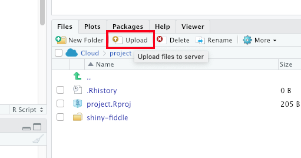

```{r setup, include=FALSE}
library(learnr)
library(png)
library(reticulate)
knitr::opts_chunk$set(echo = TRUE, fig.align = "center")
setwd("~/Intro_to_R/02-Intro_to_R")

```

## Introduction

### Learning Objective

This second short intro session aims to cover

1. A lightning introduction to R Projects
2. Importing data from csv files
2. Manipulation of data with dplyr - select, filter, mutate, group_by, summarise verbs
3. The magrittr pipe, as implemented in the tidyverse suite of packages

### Course Philosophy

* Scheduling a time that works for everyone is a pain. We all have lots of teams meetings for other responsibility. I also want to maintaining compatibility with the current Python club format. Consequently, I will talk for less than 30 mins talking each session, allowing time for Q&A and most importantly practising writing code. 
* We start from the assumption of no familiarity with R, but will also try to take into account people"s background and interests and offer something for everyone. So if you"ve already some development experience, you should learn something new about R. Equally if you"re starting from scratch sessions should not overwhelm you.
* I will point to further resources as we go. Most R resources are free or generously licensed. It"s perfectly possible to teach yourself to a high standard without spending any money on paid courses. I encourage you to browse signposted resources where you want more detail on a particular area. It"s also likely that you will find some resources that you like better than others, so if one resource doesn"t work for you, move on and try another.
* Each session should allow attendees to come away having learnt how to at least one useful core R skill, maximising the usefulness of these sessions, and maintaining the motivation to learn. We don"t want to spend hours on loading in, tidying and formatting data before we eventually get to some outputs.

<br>


<br> 

### Practice, Practice, Practice...

I strongly encourage attendees to practice with R outside of Python Club "in the day job". We will aim to cover things that you can use accordingly. I want to show you enough for you to teach yourself to do what you want to do, not show you everything.

You can access these tutorial notes after the session for reference and self-directed learning, and also share these within NICE if desired. Sessions will (very) roughly follow the NHS-R network"s introduction to R course, and the R for Data Science book by Wickham and Grolemond (https://r4ds.had.co.nz/). Feedback on sessions will shape the content of future sessions.

### Session Aims

* Attendees will be able to:
  + Describe what RStudio Projects are and why they are useful, and create them within RStudio
  + Write code to read csv files into dataframes using the tidyverse package readr,
  + Manipulate the resulting dataframes to shape, create new columns and summarise data. 
  + Understand how the magrittr pipe works and what "piping" looks like in practice.

## A lightning intro to R Projects

* R Projects are a means of organising your work within R Studio
* You should create a separate R Project for each piece of work
* The **essence** of an R Project is that it provides
  1. A directory structure
  2. A "working directory", which is a filepath that R uses as a starting point for looking for files.
* Having a working directory means that you can write shorter, more reproducible code, like read_csv("filename.csv") rather than read_csv("C:\\Users\\BloggsJ\\Documents\\R\\some_incomprehensible_file_path_that_is_just_a_pain_to_keep_typing\filename.csv")
* You can think of it as a fancy way of storing your work into folders (for now :) )
* To create a new project, go to File \\ New Project \\ New Directory \\ New Project and give it a sensible name
* The current project you"re working in will be displayed in the top right of the RStudio window. You can switch between them by using the dropdown here or by File \\ Open Project  


  

* Having created / picked a project, the directory will be visible, along with other projects within the files window as below


* And within each project directory you can see your files


### Uploading a file via RStudio Server

* To get a file on the Python Club server via RStudio, you can upload it via the "Upload" button in the files pane of the bottom right window. That should open a window to select the file, and it should be saved in the directory currently visible. 



* If you need to move a file, you can select it and move via the option under the "More" dropdown. A copy option is also available


## Reading data with readr

### Packages

* readr is a package within the tidyverse for importing flat file data, including csv. If you want to import excel files, these can also be read with the tidyverse-adjacent readxl package. The tidyverse also includes the haven package which can read STATA or SPSS files, and httr which can access web based API data. Today we"re just going to look at reading csv files.

* readr functions have C++ internals, so tend to import data much faster than base R functions as well as having greater functionality. You should use readr functions rather than the base R read.csv function in almost all cases. Tidyverse versions of functions usually contain an underscore "_" rather than a dot, so the readr version is "read_csv", the base r version is "read.csv"

* read_csv (note the underscore) takes the filename (as string) in the first argument, so you can assign a read in file as follows

```{r createcsv, message=FALSE, warning=FALSE, include=FALSE}
write_csv(diamonds, "diamonds.csv")
```

```{r readr, echo=TRUE, warning=FALSE}
#load base tidyverse
library(tidyverse)

#read in file from data subdirectory, and assign it to "df" 
df <- read_csv(file = "data/diamonds.csv")

```

* note that read_csv will take an educated guess at the types of data in each column. col_double() is a specific numeric format, so will work in this case. Usually read_csv"s interpretation will be accurate, but can fail if the column has lots of missing values, or the data is formatted poorly. You can specify the type of data manually by setting the col_types argument within read_csv.

* col_types is set equal to a specification, usually wrapped in a "cols" function

* For example, if z was actually boolean, but read_csv read it as numeric (incorrectly), you could specify 

```{r readrcoltypes, eval=FALSE, include=FALSE}

df <- read_csv("data/diamonds.csv", 
                     col_types = cols(z = col_logical()))

```

* A useful cols specification argument is col_skip(), which omits the column when importing, so can save time with large files and makes everything tidier. The following would omit columns "clarity", and "table" if we decided we didn"t need these.

```{r readrcoltypes2, eval=FALSE, include=FALSE}

df <- read_csv("data/diamonds.csv", 
                     col_types = cols(clarity = col_skip(),
                                      table = col_skip()).

```

* To get a feel for how this works, you can use the Rstudio import function, by clicking on a csv file within the files window and selecting "Import Dataset".


* This loads a nice interface which contains drop downs to select column types, and will also generate the relevant code in the "code preview" box in the bottom right.


## Manipulating dataframes with dplyr

### Dplyr

#### Overview

* Dplyr is probably the most used package within the tidyverse. The name comes from the ["split-ap*ply*-combine"](https://www.jstatsoft.org/article/view/v040i01) paradigm by Hadley Wickham, which looks to split data into smaller pieces, perform operations on those pieces, then put them back together in the way you want.

* Dplyr allows you to manipulate dataframes with a *verb* syntax, so gives a very intuitive sense for what each function in the package does.

* The main verbs that we will cover today are
  + select (picks columns of interest)
  + filter (picks rows of interest)
  + mutate (creates new columns)
  + arrange (orders rows)
  + group_by / summarise (groups rows and generates summary variables)  
  

* But before we dive into dplyr, we"ll cover the *magrittr pipe*

* Recently there has been a version of the pipe implemented in base R version 4.1, but we"re just going to cover the magrittr version here.

#### Pipes

* Pipes are an example of ["syntactic sugar"](https://en.wikipedia.org/wiki/Syntactic_sugar), making R code easier to read and write.

* The most common version of the pipe in R is the [*magrittr*](https://magrittr.tidyverse.org/) pipe. The name comes from the [painting by the surrealist artist Rene Magritte](https://en.wikipedia.org/wiki/The_Treachery_of_Images). Like readr, it"s included in the tidyverse suite of packages.

* The magrittr pipe is written as a ">" between two percentage "%" symbols - " %>% ". Rstudio has a nice keyboard shortcut (control-shift-m). 

* The pipe sits between an object and a function, or two functions. It takes whatever precedes the pipe (the left hand side), and "pipes" it into the first argument for a function on the right hand side. This makes code more readable rather than nesting functions in functions, so you can read from left to right rather than right to left.

```{r pipe}

5 %>% is.numeric()
#is the same as
is.numeric(5)

"this is the left hand side" %>% print()
#is the same as
print("this is the left hand side")

```
* It is possible to daisy-chain functions together using the pipe, so you can pass an object through several functions in one "line". In dplyr this normally takes the form of passing a dataframe through several dplyr verbs. Each function is joined up by a " %>% " pipe. For example:

```{r daisychain}

# Here we pass the diamonds dataset through select, filter, group_by and summarise functions.
# Don"t worry about the contents of each function yet, but you may be able to tell what they"re doing anyway

#how many diamonds have clarity SI2 or SI1? What is their mean price?
diamonds %>%
  select(clarity, price) %>% 
  filter(clarity == "SI1" | clarity == "SI2") %>% 
  group_by(clarity) %>% 
  summarise(n = n(), av_price = mean(price))

```

* Breaking the line at %>% also makes the code more readable. R will understand that the operation is on multiple lines. 

* Let"s look at some common dplyr verbs....


#### Select

* The select function returns an amended version of a dataframe with fewer columns. You might want to work with a subset of columns in a large dataframe, to keep things manageable and your code fast.

* Select takes an argument specifying the dataframe, either in the function or piped in, and then an argument specifying which columns to pick

* We"ll test this using the "starwars" dataframe, which is an inbuilt dataframe with details of star wars characters from the star wars api. We can take a look at the dataframe as follows

```{r staRwars}

starwars

```

* Let"s say we"re just interested in characters names, height, weight and species for now. To restrict the dataframe to these columns, we use select and pass in the column names we want as a character list using c():

```{r select}

starwars %>% 
  select(c("name", "species", "mass", "height"))
```

* Select is often also used to reorder columns, so if you wanted species first, then name, mass, and height, you would write

```{r select-reorder}
starwars %>% 
  select(c("species", "name", "mass", "height"))
```

* There are a lot of selection features you can use, like select(is.numeric) to select all numeric columns, or select(contains("color")) would select all columns where the name contains "color, like the example below.

```{r select-contains}
starwars %>% 
  select(contains("color"))
```


#### Filter

* As select allows us to remove columns we"re not interested int, filter allows us to remove rows that we"re not interested in.

* The syntax is similar, though typically we"d pass in conditions rather than a vector of row numbers.

* To select human characters who are 2 metres or taller, we"d do this

```{r filter}
starwars %>% 
  select(c("name", "height", "mass", "species")) %>% 
  filter(height >= 200, species == "Human")
```


#### Mutate

* Mutate is the verb to create new columns. It"s not as intuitively named as the others, admittedly. Typically you"ll use other columns to construct your new column variable.   

* In this case, we"ll use mass (in kg) and height (in cm) to construct a BMI value for each star wars character.

* Mutate takes the dataframe as first argument (here piped in) and then an argument to create the new column.

```{r mutate}
#NB - we filter to remove missing values by removing rows not greater than 0

starwars %>% 
  select(c("name", "height", "mass", "species")) %>% 
  filter(height > 0 & mass > 0) %>% 
  mutate("BMI" = (mass/(height/100)^2))
```
* Presto! We now have BMI values for all Star Wars characters. 


#### Arrange

* Arrange sorts the dataset according to values in specified columns.

* So to sort the star wars dataset by BMI (ascending), we would write:

```{r arrange}
starwars %>% 
  select(c("name", "height", "mass", "species")) %>% 
  filter(height > 0 & mass > 0) %>% 
  mutate("BMI" = (mass/(height/100)^2)) %>% 
  arrange(BMI)
```

* We can sort by values descending by wrapping the column in desc(). To sort by BMI **descending** would therefore be 

```{r arrange2, echo=TRUE}
starwars %>% 
  select(c("name", "height", "mass", "species")) %>% 
  filter(height > 0 & mass > 0) %>% 
  mutate("BMI" = (mass/(height/100)^2)) %>% 
  arrange(desc(BMI))
```

* Unsurprisingly, Jabba the Hutt has the highest BMI of any Star Wars character. Yoda has the third highest BMI of 39, being 2.5 stone but only 66cm tall. R2-D2 similarly would be defined as obese with a BMI > 30, which is why you should use clinical judgement and interpret BMI with caution in jedi masters and droids.


#### Group_by and Summarise

* Grouping a dataframe allows you to perform data operations by specified groups. It is most commonly used with "summarise" to create summary statistics for each group

* summarise uses similar syntax to mutate, but will return results grouped by the variables in group_by. Summarise() or summarize() will do the same thing. As the tidyverse was created by New Zealander Hadley Wickham, British English spellings work.

* To see this in action, we"ll calculate the mean, maximum and minimum BMI values for each species

```{r groupby, echo=TRUE}
starwars %>% 
  select(c("name", "height", "mass", "species")) %>% 
  filter(height > 0 & mass > 0) %>% 
  mutate("BMI" = (mass/(height/100)^2)) %>% 
  group_by(species) %>% 
  summarise(mean_bmi = mean(BMI),
            max_bmi = max(BMI),
            min_bmi = min(BMI)) %>% 
  arrange(desc(mean_bmi))
```


### Writing files back to disk

* Once you"ve manipulated the dataframe, you may wish to save results back to disk as another csv file.

* Here the write_csv function is used. This takes the dataframe you wish to save as the first argument, and the filename as the second argument. E.g.


```{r filesave}

summary_df <- starwars %>%
  select(c("name", "height", "mass", "species")) %>% 
  filter(height > 0 & mass > 0) %>% 
  mutate("BMI" = (mass/(height/100)^2)) %>% 
  group_by(species) %>% 
  summarise(mean_bmi = mean(BMI),
            max_bmi = max(BMI),
            min_bmi = min(BMI)) %>% 
  arrange(desc(mean_bmi))

write_csv(summary_df, "summary_df.csv")

```


### Recap and next Session

So hopefully you can now

1 Describe why RStudio projects are useful, 
2 Understand how to read in a csv file
3 Describe and use 6 dplyr verbs for dataframe manipulation
4 Save manipulated dataframes back to disk

The content of future sessions will be the subject of a democratic-ish vote in the python club teams channel.

## Practice Questions

### R Projects

```{r Q1_2, echo=FALSE}

quiz(question("Question 1: Why should you use RStudio Projects?",
         answer("To allow easier sharing of code and to help organise files", correct = TRUE),
         answer("To allow version control with git", message = "Yes, but this is not the main reason"),
         answer("You have to use projects when using RStudio"),
         answer("It enables error checking in RStudio"),
         random_answer_order = TRUE,
         allow_retry = TRUE),
     question("Question 2: What does an RStudio project provide you with?",
         answer("A directory for your files, a relative filepath for your directory, and the ability to save project specific options", correct = TRUE),
         answer("Access to all the packages you installed when working in that project"),
         answer("Cloud backup via RStudio Cloud"),
         answer("More secure code by fixed filepaths", message = "No - fixed filepaths are more brittle, so the code may not work when transferred elsewhere. RStudio projects allow the use of more transferable relative filepaths"),
         random_answer_order = TRUE,
         allow_retry = TRUE)
)

```

### Reading data

```{r Q3_4, echo=FALSE}

quiz(
     question("Question 3: Which tidyverse package is often used to read in data",
         answer("readr", correct = TRUE),
         answer("dplyr"), 
         answer("ggplot2"),
         answer("purrr"),
         random_answer_order = TRUE,
         allow_retry = TRUE),
     question("Question 4: What is the readr function to read a csv file?",
         answer("read_csv()", correct = TRUE),
         answer("read.csv()", message = "Close. This is the base r version"),
         answer("pd.read_csv()", message = "No - this is pandas code!"),
         answer("read(file = '.csv')"),
         random_answer_order = TRUE,
         allow_retry = TRUE)
     )

```

### Dplyr and the magrittr pipe

```{r Q5_6, echo=FALSE}

quiz(question_checkbox("Question 5: Which of the below are dplyr verbs?",
                       answer("select", correct = TRUE),
                       answer("mutate", correct = TRUE),
                       answer("arrange", correct = TRUE),
                       answer("group_by", correct = TRUE),
                       answer("summarise", correct = TRUE),
                       answer("delete"),
                       answer("search"),
                       answer("sort"),
                       answer("add_column"),
                       random_answer_order = TRUE,
                       allow_retry = TRUE,
                       try_again = "There are 5 correct answers to select"),
     question("Question 6: Which dplyr verb creates a new column?",
              answer("mutate", correct = TRUE),
              answer("create_col"),
              answer("select"),
              answer("add_column")),
     question("Question 7: Which one of the below is the correct syntax for the margrittr pipe, piping the number 5 into a is.numeric() function",
              answer("5 %>% is.numeric()", correct = TRUE),
              answer("is.numeric() %>% 5"),
              answer("is.numeric(5)", message = "No - this is non-piped syntax"),
              answer("5 %>% is.numeric"), message = "You still need to include the brackets for the right hand side function"),
    question_checkbox("Question 8: Which dplyr code returns only the name and height columns from the starwars dataset?",
             answer("starwars %>% select(name, height)", correct = TRUE),
             answer("select(starwards, name, height", correct = TRUE),
             answer("starwars %>% mutate(name, height", message = "mutate is not the correct verb"),
             answer("starwars %>% select(name, species)", message = "check the column names"),
             answer("starwars.select(name, species"),
             random_answer_order = TRUE,
             allow_retry = TRUE,
             try_again = "There are two correct answers, one using a pipe, one without a pipe"),
    question("Question 9: Which piped dplyr code returns only rows containing droids from the starwars dataframe?",
              answer("starwars %>% filter(species == 'Droid')", correct = TRUE),
              answer("starwars %>% filter(species = 'Droid')", message = "you need two equals signs for equality"),
              answer("starwars %>% select(species == 'Droid')", message = "select returns columns not rows"),
              answer("starwars %>% select(species = 'Droid'"),
              random_answer_order = TRUE,
              allow_retry = TRUE),
     question("Question 10: Which piped dplyr code arranges the starwars dataframe in height order?",
              answer("starwars %>% arrange(height)", correct = TRUE),
              answer("starwars %>% select(ascending(height))"),
              answer("starwars %>% arrange(mass)"),
              answer("starwars %>% sort(height)"),
              random_answer_order = TRUE,
              allow_retry = TRUE))

```

11. Load up Rstudio and type library(dyplr) into the console to load dplyr and the starwars dataframe. Can you write an expression using two piped dplyr verbs that returns the name and height columns from the Droid rows only. You may have to think about the order in which you specify the relevant verbs.

```{r Q12_13, echo = FALSE}

quiz(question("Question 12: Which piped dplyr code creates a new column that is twice the height column?",
              answer("starwars %>% mutate(height_times_two = 2*height)", correct = TRUE),
              answer("starwars %>% mutate(2*height = height_times_two)", message = "the new variable goes first, followed by the definition"),
              answer("starwars %>% select(height_times_two = 2*height)"),
              answer("starwars %>% summarise(height_times_two = 2*height"),
              random_answer_order = TRUE,
              allow_retry = TRUE),
     question("Question 13: Which piped dplyr code returns the mean average height split by eye_color?",
              answer("starwars %>% group_by(eye_color) %>% summarise(mean_height = mean(height, na.rm = TRUE)", correct = TRUE),
              answer("starwars %>% summarise(mean(height, na.rm = TRUE))"),
              answer("starwars %>% select(eye_color) %>% summarise(mean(height, na.rm = TRUE))"),
              answer("starwars %>% summarise(mean(height, na.rm = TRUE)) %>% group_by(eye_color)"),
              random_answer_order = TRUE,
              allow_retry = TRUE
              ))

```


14. Load Rstudio and the dplyr package. Can you filter the starwars dataset to rows where height >100?

15. Extending this query, find out who is the shortest character whose height is still >100 by re-arranging the dataset to order by height ascending

16. Using group_by and summarise, find out the mean average height of characters split by gender. Note that you will need to include the argument "na.rm = TRUE" in your mean function so it ignores missing data.

17. Amongst droids, which is the most common eye_color? You may want to lookup the 'n' function to use in your summarise verb.

18. Lookup the select help documentation with by typing ?select at the console. Can you use a helper function within select to return all rows of starwars where the skin_color contains "red"?

19. Create a new column of starwars calculating BMI for each character (see earlier notes). Can you pipe the resulting dataset into histogram using ggplot and geom_histogram?

20. Group_by and summarise the data to create a summary statistic and grouping variable of your choice. Use a pipe to feed this into a ggplot bar graph


## Further Resources

#### R help files

Help and syntax for any particular function can be accessed by typing ? plus the function name into the console, e.g. ?data.frame. Searches of the help documentation can be run by typing a double question mark followed by the search term, e.g. ??object. Often this can solve specific queries fairly quickly.

#### Websites

Other specific error messages or questions can often be resolved by a search on [Google](www.google.co.uk) or [Stack Overflow](https://www.stackoverflow.com) . There are also lots of tutorials and short videos on [Youtube](https://www.youtube.com/results?search_query=R+tutorials) if you know what you"re searching for. There is also a R specific search engine built on the back of google called [R-Seek](https://www.rseek.org) which does a good job of narrowing down and filtering to R content only. The [NHS-R community website](https://nhsrcommunity.com) also offers recordings, blogs and other R resources. Their slack channel is useful for queries and R related news. [R-bloggers](https://r-bloggers.com) also aggregates R blogs so can be useful to monitor or search for things of interest. [R weekly](https://rweekly.org) is a mailing list which gives you up to date developments with all things R.

#### Free online books

For non-specific issues or general learning, many R books are freely available online, and have the advantage of being continually updated. Useful starting points are

**General R / Introduction**

[R for Data Science](https://r4ds.had.co.nz/) by Hadley Wickham, original author of the tidyverse suite and chief Data Scientist at RStudio  
[YaRrr! The Pirate"s Guide to R](https://bookdown.org/ndphillips/YaRrr/) by Nathaniel Phillips, containing a good introduction to R with additional buccaneering based humour, if you like that sort of thing.  
[R Cookbook](http://www.cookbook-r.com/) by Winston Chang. Useful Reference Guide for R concepts  
[R Studio Cheat Sheets](https://www.rstudio.com/resources/cheatsheets/). Particularly ggplot2 and base r cheat sheets. Also available in Rstudio under the help menu/Cheatsheets/Browse Cheatsheets

**Visualisation**

[ggplot2 Elegant Graphics for Data Analysis](https://ggplot2-book.org/) by Wickham, Navarro and Pederson. Explains the grammar of graphics and how this is implemented in ggplot2
[R-Charts](https://r-charts.com/) is a nice repository of charts to demonstrate the possibilities of using R and ggplot2, for inspiration & motivation.

**R Programming**

[Hands on Programming with R](https://rstudio-education.github.io/hopr/index.html) by Garrett Grolemund. More detail on R programming concepts, notation, practical programming  
[Advanced R](https://adv-r.hadley.nz/) by Hadley Wickham. Useful for those with an existing understanding of programming concepts from other languages, or advanced R users. **Not** an introductory book.
